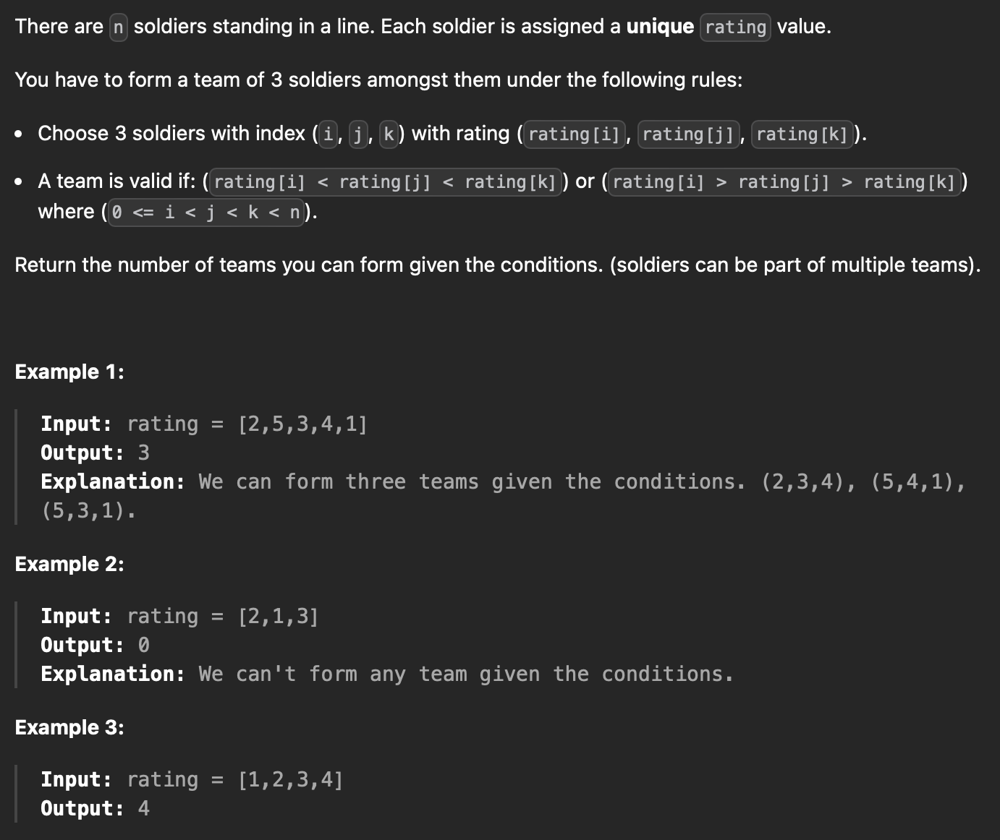
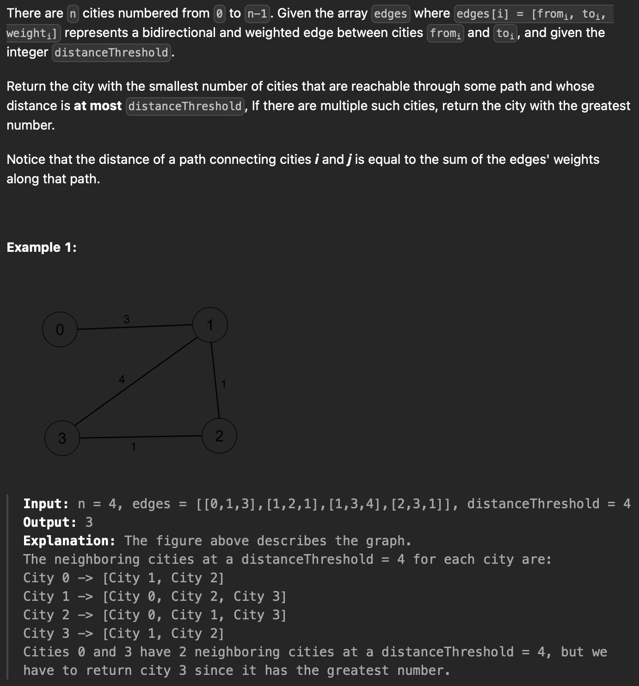
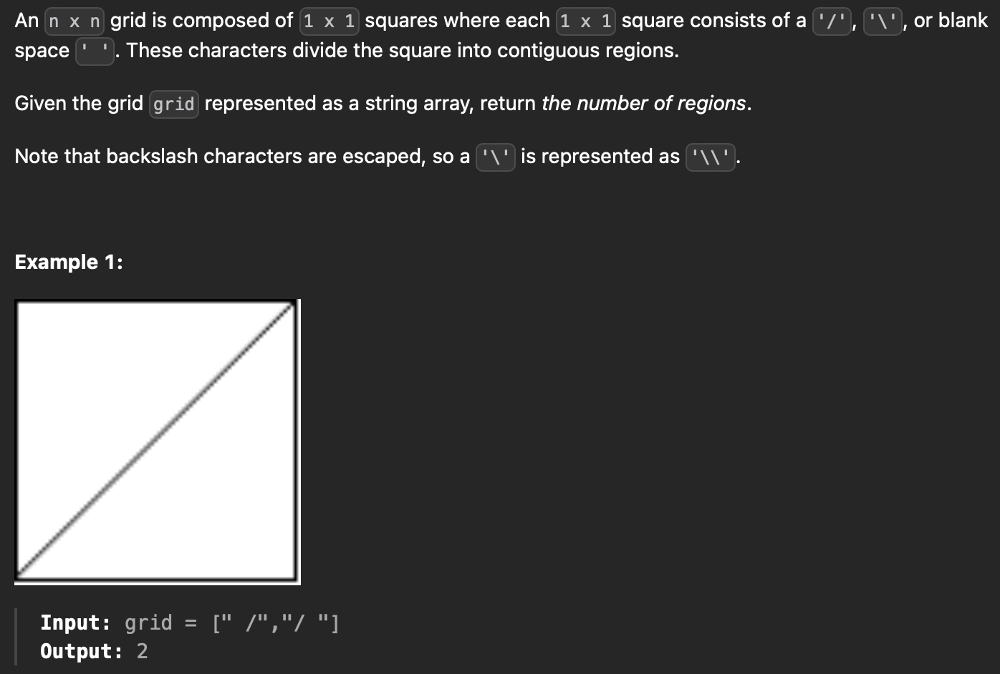

# 1. Binary Search

When facing a problem which need to be solved within ```O(nlog(n))```, or ```O(log(n))``` appears in any forms, try binary search!

In general, binary search is a good try for questions with these characteristics:

1) ***The target value is bounded***

2) ***A direction towards the target value (lower or higher) could be determined given a non-target value***

3) ***It's not very expensive to check whether a value is target or not***

In addition, binary search is also very useful when trying to find things within a sorted scope. If the scope is not sorted and we need to perform multiple ```find``` operation, consider sorting the scope and use binary search for each ```find``` operation.

<br/>

## 1552 Magnetic Force b/t Balls

***Difficult: 7/10***

***Interesting: 5/10***

***Educating: 10/10***


<br/>

The reason this question is very educating is that there's only one way to solve it within the required time frame: binary search.

Its obvious that the result for this question lies within ```[1, position[-1]]```. The observation most people overlooks, however, is that for any "required force" ```x <= result```, ```x``` should also be a valid distance to place ```m``` balls in positions because by definition ```result = max(x)``` for all ```x``` that's valid. These characteristics are signs for using binary search.

Now we need to think about the time to verify if a given distance between balls could be accomplished or not.

Given the target absolute distance ```x```, we could start with the first ball at ```position[0]``` and go through the positions until we've reached the first index ```i``` where ```position[i] >= position[0] + x```. We place the second ball at ```position[i]```. Now we start going through positions again beginning from index ```i + 1``` until we've reached the first index ```j``` where ```position[j] >= position[i] + x``` and place the third ball there. We continue this process until all ```m``` balls have been place, which means ```x``` as the "required force" could be done, or we run out of positions to place the balls, which means ```x``` as the "required force" could not be done. Either way, it takes ```O(n)``` time to verify whether a given distance is valid.

Therefore performing a binary search on the largest distance between balls would take ```O(n)``` for each verification and ```O(log(n))``` to find the boundary between valid and non-valid "required force", a total of ```O(nlog(n))```.

To reflect the general characteristics of binary search in the case of this question, the target value is the max distance between balls. Observe that

1) The target value is bounded by ```[1, position[-1]]```

2) The target value is the maximum of all valid values. This means if a given value ```x``` is valid, ```target >= x```; if a given value ```y``` is not valid, ```target < y```

3) It only cost one iteration of the entire position array, i.e. ```O(n)```, to check whether a given ```x``` is valid or not

Therefore when facing a question with similar characteristics, always gives binary search a try.

## 1482 Min days to make n bouquets

***Difficult: 6/10***

***Interesting: 6/10***

***Educating: 7/10***


<br/>

The common way to solve this problem is binary search. Think about the runtime to check if a given result would satisfy the criteria. It suppose to be ```O(n)```. Then we can perform a binary search on the result within the max and min of the given days and would produce a result within ```O(nlog(n))```. If the values of the days array is unbounded, we could sort the array first and perform binary search on the indexes of the array instead.

There's another approach to this problem: disjoint set. We could sort the days array and add each day sequentially while maintain a dictionary of the current status, i.e. [```key```, ```value```] represent ranges of blooming flowers. For each newly added position, we try to merge it into adjacent existing ranges, or create a new range itself, as well as maintaining the current max bouquets number, all in constant time. This way there's constant runtime for each position added and every position is added only once therefore the runtime for adding position is ```O(n)```. However, since we sorted the days array in the beginning, the overall runtime is also ```O(nlog(n))```.

<br/>

# 2. Dynamic Programming

## 956 Tallest Billboard

***Difficult: 10/10***

***Interesting: /10***

***Educating: /10***


<br/>

TODO

<br/>

# 3. Sliding Window

## 1438 Longest cont subarray w/ abs diff limit

***Difficult: 5/10***

***Interesting: 4/10***

***Educating: 9/10***


<br/>

The original method I used and the sliding window method is quite similar in terms of the general approach of using two pointers representing a subarray to traverse the entire array while keeping track of the absolute difference. Both of these methods would increase right pointer incrementally and move the left pointer rightward until the max absolute difference of the subarray is within the boundary.

However, the later method uses a better storage system that reduces the runtime to ```O(n)``` instead of ```O(nlog(n))```. My initial method uses two heaps, one max heap and one min heap, and a counter dictionary to keep track of the count of values as well as the max absolute difference within the subarray. This requires maintaining heaps which cost ```O(log(n))``` for each operation. Instead, we could accomplish the same goal using two deques, a max deque and a min deque.

Whenever we move the right pointer to the right, we want to insert the new value ```x``` into the two deques so that ```x``` is at the top of the deques and all other values are larger/smaller than ```x``` in maxstack/minstack. Notice that by doing so, the deques would actually be ordered.

***This is a common practice to keep track of the largest/smallest value for a changing array.***

Once the deques are updated, we keep moving the left pointer to the right, remove any bottom values of the deques, namely the largest and smallest value within the subarray, that is equal to the discarded value, until the bottom of the two deques have a absolute difference smaller or equal to the limit.

This method is valid because the deque, take the max deque as an example, is maintained in a way where its sorted in descending order from bottom to top, and each value, if in the deque, is the largest value from the previous max/min (the value one place lower than it in the deque) to the current right end of the array. Therefore when we pop the bottom of the maxdeque/mindeque, the new bottom value is the new max/min of the subarray. A tricky edge case would be duplicate values in the subarray, in which case we keep all the duplicates in the deque.

## 2009 Min number of operation to make array continuous

***Difficult: /10***

***Interesting: /10***

***Educating: /10***


<br/>

There's two different way to solve this question: sliding window, and perhaps surprisingly, binary search.

TODO

<br/>

# 4. Tree

## 1038 BST to Greater Sum Tree

***Difficult: 3/10***

***Interesting: 1/10***

***Educating: 7/10***


<br/>

How to solve this problem using postorder by recursion is relatively easy. A good followup question would be how to solve it using simple stacks (or how to solve inorder/postorder using stacks in general).

(the algorithm below could be optimized using a stack of tuple, but here we assume only simple stacks, i.e. stacks of uniterable types, could be used)

We can start with two stacks, one have ```root``` in it, ```s1```, and another empty, ```s2```, and a sum calculator ```x = 0```. While ```s1``` is not empty, pop the top item in ```s1``` as ```curr```. If ```curr``` is a leaf node, update ```curr.val``` and ```x``` accordingly. If ```curr``` is equal to the top item in ```s2```, update ```curr.val``` and ```x``` accordingly and pop the top itme in ```s2```. In all other cases, push ```curr.left``` to ```s1``` if its not none, push ```curr``` to ```s1``` again, push ```curr``` to ```s2```, and push ```curr.right``` to ```s1``` if its not none. Return ```root``` at the end.

Here ```s2``` serve as a path tracker or visited map. If a parent node is visited for the first time, we add its children to the stack as well as itself, without processing it. The next time this node appears, we process it and does not add anything to the stack to prevent infinite loop.

<br/>

## 1395 Count Number of Teams

***Difficult: TODO/10***

***Interesting: TODO/10***

***Educating: TODO/10***



<br/>

Binary search and Binary Indexed Tree (Fenwick Tree)

TODO

<br/>

# 5. Graph

## 1579 Remove max # of edges to keep graph fully traversable

***Difficult: 8/10***

***Interesting: 7/10***

***Educating: TODO/10***


<br/>

TODO

<br/>

## 2392 Build a Matrix with Condition

***Difficult: 8/10***

***Interesting: 7/10***

***Educating: 10/10***


<br/>

Take a closer look at this question and you'll find its actually a graph sorting question: 

If we find two sequences of numbers representing the horizontal and vertical order where each satisfies that ```l``` comes before ```r``` for all ```(l, r)``` in row or column conditions, we can construct such matrix with ease. For example, for any given two sequences of 1, 2, 3, we can use the index of a given number from the first sequence, ```i```, and the index of that number from the second sequence, ```j```, to locate its position in the resulting matrix: ```[i, j]```. For example, sequences 3-1-2 and 3-2-1 gives us the matrix from example 1 in the question description.

It's also related to graph because each ```r``` could have several ```l``` depended on it and therefore making the requirements/prerequisites a graph.

Therefore it is what's called a topological sorting question and we could use ***Kahn's Algorithm*** to solve this.

Kahn's Algorithm finds a linear ordering of vertices for a ***Directed Acyclic*** graph, such that for every directed edge ```u``` -> ```v```, vertex u comes before v in the ordering. The algorithm works by repeatedly finding vertices with no incoming edges, removing them from the graph, and updating the incoming edges of the remaining vertices. This process continues until all vertices have been ordered.

To initialize the algorithm, we first need to find the ***in-degree*** of each node/number. We calculate the number of incoming edges to each node. Iterate through all the edges in the graph and increment the in-degree of the destination node, or ```r```, for each edge.

From there, we create a queue filled with all 0 in-degree nodes (i.e. nodes w/ 0 incoming edges) and start subtracting the number of incoming edges for their children, then put all nodes with 0 incoming edges to the queue and repeat until the queue is empty. The sequence we pop from the queue is the topological sort that we're looking for.

Time complexity of Kahn's algorithm: ```O(V + E)```.

Space complexity of Kahn's algorithm: ```O(V)```.

Node that Kahn's algorithm only works on ***directed*** and ***acyclic*** graph. If a graph is not directed, we won't be able to know if an edge from ```u``` to ```v``` means ```u``` must comes before ```v``` or the other way around. If a graph have a cycle within it, then the nodes on this cycle will never reach the state where they have 0 incoming edges and thus would not be included in our final output. (This phenomenon could actually be used to detect cycle within a directed graph!)

<br/>

## 1334 Find the City w/ Min # of Neighbor at a Threshold Distance

***Difficult: 7/10***

***Interesting: 6/10***

***Educating: 10/10***



<br/>

There 4 ways to solve this question: Dijkstra's Shortest Path Algorithm, Floyd–Warshall algorithm, Bellman–Ford Algorithm, and Shortest Path Faster Algorithm (SPFA).

1) ***Dijkstra's Shortest Path Algorithm***

Dijkstra's Algorithm finds the Shortest Path Tree, SPT, or the shortest path to any other nodes for a given root node in a non-negatively-weighted graph. It starts with root, update and keeps track of the shortest distance/path for each children of the current node, and choose the next node to visit by selecting the one with the shortest distance to root, until all nodes are visited.

Here's a short description of the implementation of Dijkstra's algorithm: We start by creating a minheap ```h```, an adjacency list ```adj```, and a visited array ```v```. ```h``` starts with just one element: ```(0, root)```, ```adj``` starts with 0 at ```adj[root]``` and positive infinity at all other spots, and ```v``` starts with all```False```. While ```h``` is not empty, we pop the min element ```curr``` and mark it as visited on ```v```. Then for all of its children, we find its current path distance ```adj[curr] + w_child```. If it is smaller than ```adj[child]```, we use it to update ```adj``` and heappush ```(adj[child], child)``` to ```h```. Repeat this process until the heap is empty (or all nodes are visited, minor differences but both correct). Node that in this approach multiple instances of same vertex is allowed in the heap and we only consider the instance with minimum distance.

If SPT is what expected as output, just keep track of an additional dictionary where keys are child nodes and values are parent nodes. Update dictionary accordingly when ```adj``` got updated and reconstruct the tree using this dictionary at the end.

***Time complexity of Dijkstra's Algorithm: ```O(Elog(V))```.*** A better runtime of ```O(E + Vlog(V))``` could be accomplished by using the [Fibonacci Heaps](https://www.youtube.com/watch?v=6JxvKfSV9Ns). My own implementation of Fibonacci Heaps could be found [here](https://github.com/DanielWang2029/Python-and-Algorithms/blob/master/Data_Structures_and_Algorithms/Fibonacci%20Heap).

***Space complexity of Dijkstra's Algorithm: ```O(V)```.***

The reason Dijkstra's Algorithm cannot be used on negatively-weighted graphs is because it assumes that once a node is marked as visited, its distance is finalized and will not change. This assumption breaks when negative weights are introduced and a shorter path could be later found out for an already visited node.

2) ***Bellman–Ford Algorithm***

Bellman-Ford algorithm is also guaranteed to find the shortest path in a graph. The only limit for Bellman-Ford is that there cannot exist a negative cycle in the graph. Compared to Dijkstra's algorithm, Bellman-Ford is slower but is capable of handling ***directed*** graphs with negative edge weights. Since undirected graphs are essentially directed graph with additional swapped edges, an undirected graph with negative edges would result in negative cycles in the equivalent directed graph hence cannot be analyzed by Bellman-Ford.

The principle idea behind Bellman-Ford is to relax edges. We start by maintaining a distance array/ adjacency list ```adj``` just like in Dijkstra. In each relaxation, we go through each edge ```(u, v)``` and see if going from ```u``` to ```v``` lead to a shorter distance for ```v```, i.e. whether ```adj[u] + w < adj[v]```. If so, we update the adjacency list accordingly using ```adj[v] = adj[u] + w```. We repeat this relaxation for ```V - 1``` time and return the adjacency list ```adj```. The reason for ```V - 1``` is that in worst-case scenario, a shortest path between two vertices would go through every vertices and have at most ```V - 1``` edges, given that no negative cycles exist in the graph therefore no loops are formed during the path.

***Time complexity of Bellman-Ford Algorithm: ```O(VE)```.***

***Space complexity of Bellman-Ford Algorithm: ```O(V)```.***

We can also use Bellman-Ford Algorithm to detect negative cycles: After ```V - 1```th relaxation, we want to relax all edges one more time, reaching ```V``` iterations. If the update criteria ```adj[u] + w < adj[v]``` successes for any edges, then there exists negative cycles in the graph. This is because during the ```V - 1```th relaxations, we presume that each vertex is traversed only once. However, the reduction of distance during the ```V```th indicates that we revisited at least one vertex resulting a loop in our traversed path, which indicates a negative cycle in the graph.

3) ***Shortest Path Faster Algorithm (SPFA)***

The shortest path faster algorithm is based on Bellman-Ford algorithm, but in SPFA, a queue of vertices is maintained and a vertex is added to the queue only if that vertex is relaxed. This process repeats until no more vertex can be relaxed.

We start by creating a queue ```q``` and a set ```s``` containing all the elements in ```q```, both having the root vertex in it initially, in addition to the adjacency list ```adj```. while the queue is not empty (which is equal to the set being not empty), we pop the leftmost item ```curr``` in ```q``` and delete it from ```s```. For every outgoing edges ```(curr, v)``` of ```curr```, we calculate whether the update criteria ```adj[curr] + w < adj[v]``` is met. If so, we update the adjacency list through ```adj[v] = adj[curr] + w``` and add ```v``` to ```q``` and ```s``` if ```v``` is not already in ```s``` (consequently not in ```q```). Return ```adj``` once ```q``` is empty.

***Time complexity of SPFA: ```O(VE)```.***

***Space complexity of SPFA: ```O(V)```.***

4) ***Floyd–Warshall algorithm***

Floyd-Warshall algorithm is also an algorithm for finding the shortest paths in a directed, weighted graph without negative cycles. Its core is a recursive function ```f``` which takes three inputs, ```i```, ```j```, ```k```, and returns the length of the shortest path from ```i``` to ```j``` using vertices only from set ```{1, 2, ..., k}``` as intermediate points on the way. Given this function, the result we're looking for is ```f(start, end, V)``` which gives the shortest path length from ```start``` to ```end``` using all ```V``` vertices.

For the recursive relation, observe that ```f(i, j, k)``` should be smaller or equal to ```f(i, j, k - 1)``` because the latter has less available vertices for traversal. If ```f(i, j, k)``` is indeed less than  ```f(i, j, k - 1)```, then there must exist a path that goes through ```k``` which is shorter than any path that does not go through ```k```. Therefore we can decompose the shortest path into two parts:

(1) a path from ```i``` to ```k``` using only vertices from ```{1, 2, ..., k - 1}```.

(2) a path from ```k``` to ```j``` using only vertices from ```{1, 2, ..., k - 1}```.

Both of these sub-paths have to be the shortest among all paths that satisfy the criteria, giving us this recursive formula:

```f(i, j, k) = min(f(i, j, k - 1), f(i, k, k - 1) + f(k, j, k - 1))```

The base case of this recursive function is given by:

```f(i, j, 0) = w(i, j)```

where ```w(i, j)``` is the weight of the edge connecting ```i``` and ```j```, positive infinity if such edge does not exist.

In terms of implementing Floyd-Warshall algorithm, we could use dynamic programming on a two dimension ```dp``` array. First we initialize the ```dp``` array where ```dp[i][j]``` equals ```w(i, j)``` if the edge ```(i, j)``` exists otherwise positive infinity, and ```dp[v][v] = 0``` for all vertices. Here ```dp[i][j]``` represents the value of ```f(i, j, 0)```. Then for every ```k``` from ```1``` to ```V```, we iterate through each pair of ```(i, j)``` and update ```dp[i][j]``` to ```dp[i][k] + dp[k][j]``` if the later is smaller. This is equivalent to finding the value of ```f(i, j, k)``` using ```f(i, k, k - 1)``` and ```f(k, j, k - 1)``` in the recursive relation. The ```dp``` table after ```V```th iteration of ```k``` is the result we're looking for, where ```dp[i][j]``` represents the length of shortest path from ```i``` to ```j```, or ```f(i, j, V)```.

Note that for certain values of ```i```, ```j```, and ```k```, ```dp[i][k]``` or ```dp[k][j]``` might already been updated in the same iteration of ```k``` before ```dp[i][j]```, meaning the value they represents are actually ```f(i, k, k)``` and ```f(k, j, k)``` rather than ```f(i, k, k - 1)``` and ```f(k, j, k - 1)```. However, observe that if ```i = k``` or ```j = k```, ```f(k, j, k - 1) = f(k, j, k)``` and ```f(i, k, k - 1) = f(i, k, k)``` because a path from or to ```k``` will not be using itself as an intermediate vertex. Therefore the recursive formula still holds.

***Time complexity of Floyd-Warshall algorithm: ```O(V^3)```.***

***Space complexity of Floyd-Warshall algorithm: ```O(V^2)```.***

Similar to Bellman-Ford Algorithm, Floyd-Warshall algorithm can also be used to detect negative cycles: If a negative cycle exists, then the length of the shortest path from a vertex on that cycle to itself would be less than the initial value of ```0```. Therefore we can simply inspect the diagonal of the ```dp``` matrix during any time of the algorithm, and the presence of a negative number indicates that the graph contains at least one negative cycle.

<br/>

# 6. Union Find

## 959 Regions Cut by Slashes

***Difficult: 4/10***

***Interesting: 5/10***

***Educating: 6/10***



<br/>

This is a classic union find question on first glance. It's how to define a base element that's worth discussing.

My initial approach is to divide each block into four square subblocks: upperleft, upperright, lowerleft and lowerright. To deal with slashes, my approach lets them block two subblocks on the diagonal, leaving the other diagonal free to union/join with subblocks of adjacent blocks. This is somewhat counterintuitive as the subblocks are not divided along the slashes. A more intuitive approach is to divide each block into four triangular subblocks: up, down left and right. If slashes are present, it's guaranteed to have two whole subblocks on each side of the slashes covering two sides of the block, and we can union/join them together along with subblocks of adjacent blocks.

Both of these approaches have ```4n^2``` subblocks as base elements therefore the runtime is ```O(4n^2log(4n^2))```. However, there exist a better solution:

Think about when do we know for sure that an additional region is formed. It is when we draw a slash and found out that it finishes a loop of edges, i.e. it connects two existing and already connected edges. The takeaway from this is that we can treat points, not blocks, as base elements in our union find solution and we union/join points to represent connected edges, rather than union/join blocks to represent connected region.

Specifically, we could create a new grid of points ```g``` of size ```(n + 1) * (n + 1)``` and initialize the border of the grid (every ```g[i][j]``` where ```i = 0``` or ```j = 0``` or ```i = n``` or ```j = n```) to be in a same group while every inner point of the grid has its own group. Now we iterate through all the slashes and union/join ```g[i][j]``` and ```g[i + 1][j + 1]``` if a slash, i.e. ```\```, is found on ```grid[i][j]```, or union/join ```g[i + 1][j]``` and ```g[i][j + 1]``` if a backslash, i.e. ```/```, is found on ```grid[i][j]```. If before joining we notice that the two points are already connected and are in the same group, we know that we've closed a circle of edges and we want to add ```1``` to the result. Return the result after every slashes are visited.

This solution have ```(n + 1)^2``` points as base elements therefore the runtime is ```O((n + 1)^2log(n + 1)^2)```, which is the same big-O notation of runtime as previous approaches but runs noticeably faster in practice.

<br/>

# 7. Math

## 330 Patching array

***Difficult: 9/10***

***Interesting: 10/10***

***Educating: 1/10***


<br/>

Lets first define a simple case where the array is "non-sparse", meaning all numbers within the range of the values, min to max, could be written into a sum. For example, [1, 2, 3, 5, 9] would be a "non-sparse" array where [1, 2, 4, 9, 15] is not because 8 cannot be written into a sum.

From here, It's reasonable to guess that:

1) For a given "non-sparse" array, the next value to be patched/added (if needed) is the sum of the array plus 1. In other words, given a "non-sparse" array ```arr```, the smallest number that cannot be written as the sum of current arr values is the ```sum(arr) + 1```

2) Adding the smallest missing/unreachable/unsumable number is better than adding any number that is smaller than it.

Given these guesses, it's easy to derive the final solution. The hard part, however, lies within the proof of these assumptions.

For guess #1, we can prove it by induction:

Consider the smallest number that cannot be written as a sum of current values, which lets call ```s```.

First we want to argue that ```s``` should be larger than the largest value inside ```arr```, which lets call ```x1```. This is because by definition of "non-sparse" all number smaller or equal to ```x1``` is sumable, i.e. written as a sum of values in ```arr```.

Next we want to argue that ```s``` should be larger than the sum of ```x1``` and ```x2```, which is the second largest value inside ```arr```. This is because if ```s``` is smaller or equal to ```x1 + x2```, we can find a set of values from ```arr```, lets say ```set2```, that sums to ```s - x1``` since ```s - x1 < x1```. We can observe that ```x1``` is not in ```set2``` because the sum of ```set2```, ```s - x1```, is smaller than ```x1```, and a new ```set = set2 + {x1}``` sums to ```s```. Therefore it contradicts the definition that ```s``` is not sumable.

We can further show that ```s``` should be larger than the sum of ```x1```, ```x2```, and ```x3```, which is the third largest value inside ```arr```. This is because if ```s``` is smaller or equal to ```x1 + x2 + x3```, but larger than ```x1 + x2```, we can find a set of values from ```arr```, ```set3```, that sums to ```s - x1 - x2``` since ```s - x1 - x2 < x2```. We can observe that ```x1``` and ```x2``` is not in ```set3``` because the sum of ```set3```, ```s - x1 - x2```, is smaller than ```x1``` or ```x2```, and a new ```set = set3 + {x1, x2}``` sums to ```s```. Therefore it contradicts the definition that ```s``` is not sumable.

Now by induction we could show that ```s``` is greater than the sum of ```x1```, ```x2```, ..., ```xn```, which means that ```s``` is greater than the sum of ```arr```. Therefore the smallest ```s``` possible is ```sum(arr) + 1```.

For guess #2, we can prove it using the result from guess #1.

First, we rewrite guess #2 into a more mathematical term: Given the current array is "non-sparse" and the choice to add ```s = sum(arr) + 1``` or an arbitrary ```p < s``` to the array, adding ```s``` is always the better choice, i.e. create an array that could "sum" more numbers.

By the result from guess #1, we know that for all ```x < s```, ```x``` is sumable without adding any additional value. From there we could argue that by adding either ```s``` or ```p``` to ```arr```, the new array, ```arr_new```, is also "non-sparse". This is because either ```s``` is added, ```max(arr_new) = s``` which is sumable, and therefore all numbers smaller or equal to ```max(arr_new)``` is sumable, or ```p``` is added, ```max(arr_new) = max(p, max(arr)) < s```, and by definition all numbers smaller or equal to ```max(arr_new)``` is sumable.

Now we use the result from guess #1 again which gives us the total sumable numbers of ```arr_new``` for adding ```p``` is ```sum(arr) + p < sum(arr) + s```, the total sumable numbers for adding ```s```. This means adding any ```p < s``` to ```arr``` would lead to less number being able to be sumed from ```arr_new```, compared to adding ```s``` to ```arr```. Therefore adding ```s``` to ```arr``` is always the better choice.

Now that we've proved these assumptions, its easy to write a code to solve this problem in ```O(log(n))```: Start with an empty list, ```arr```, and a counter, ```result```, calculate the current ```s = sum(arr) + 1```. If the first value in ```arr``` smaller or equal to ```s```, remove it from ```nums``` and add it to ```arr```. If the first value is larger than ```s```, add ```s``` to ```arr``` and add 1 to ```result```. Now recalculate ```s``` and repeat this process again until ```s``` > ```n```. Return the counter, ```result```.
