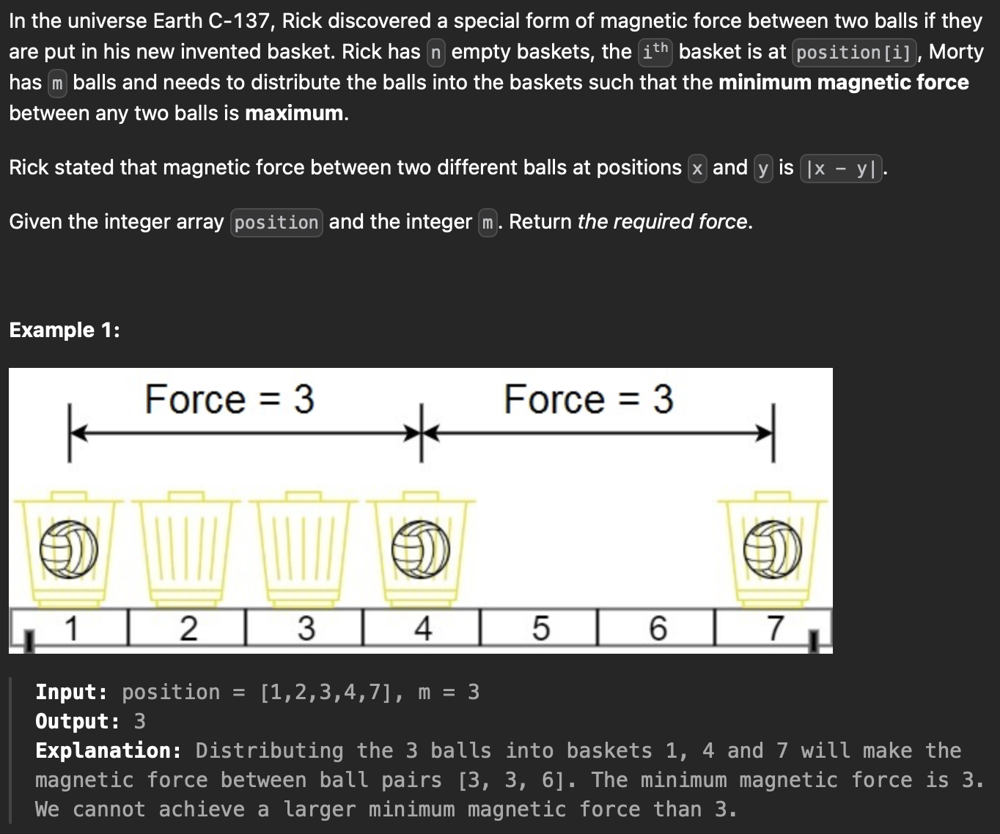
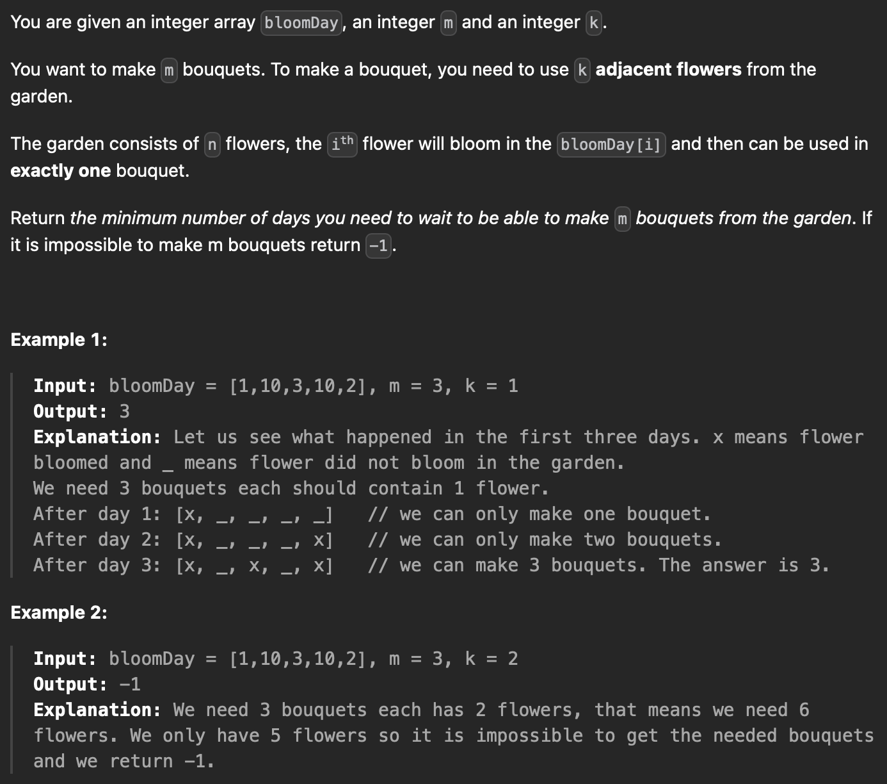
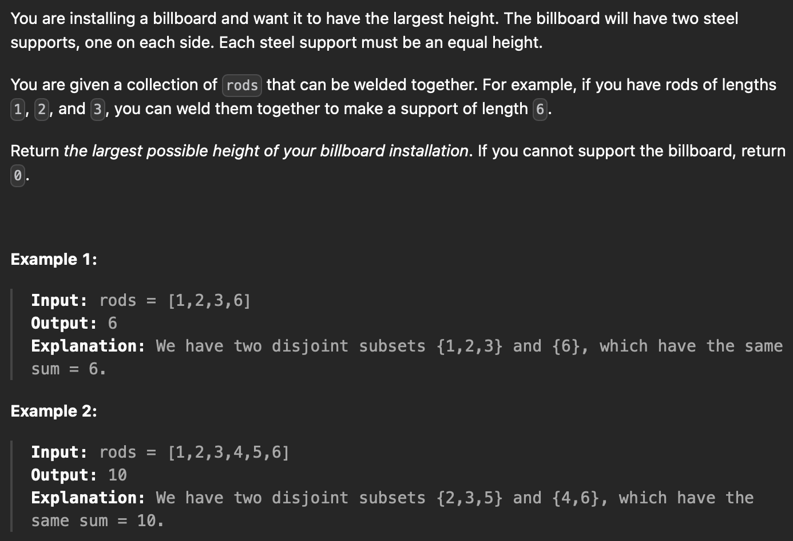
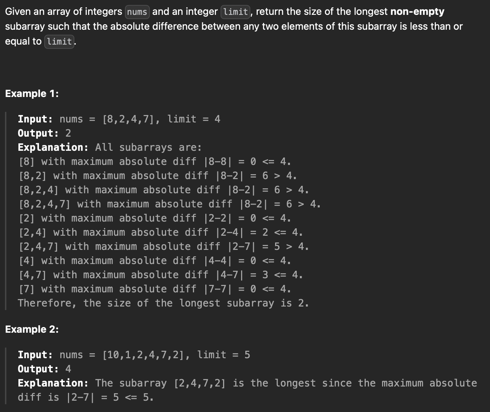
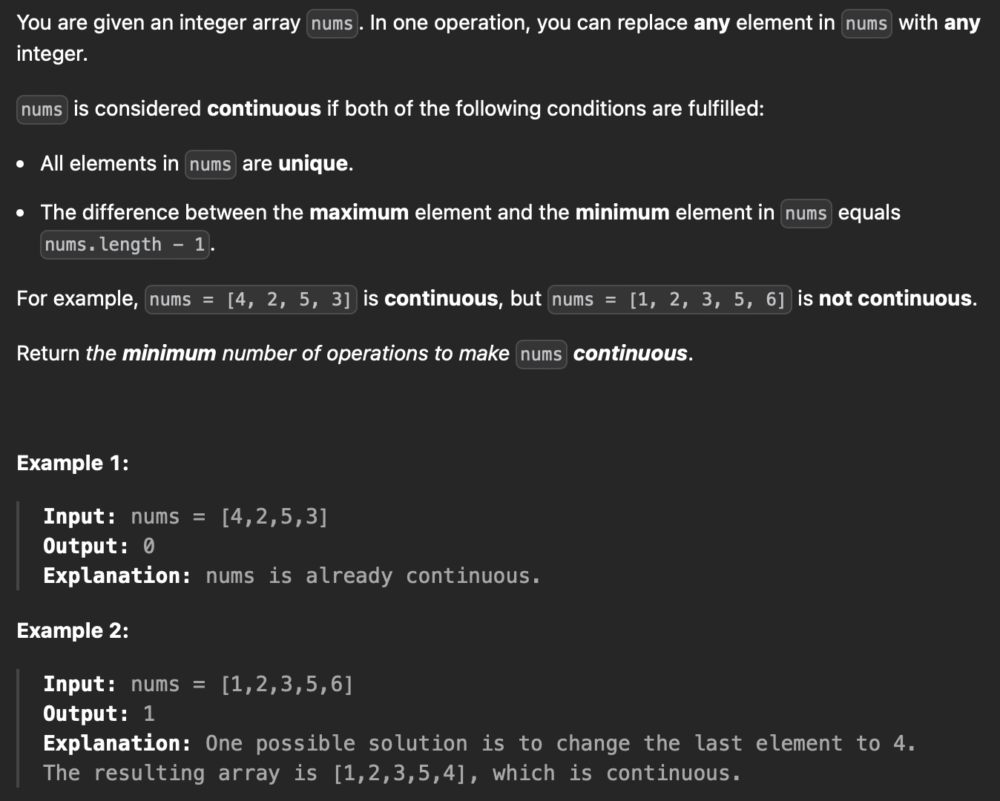
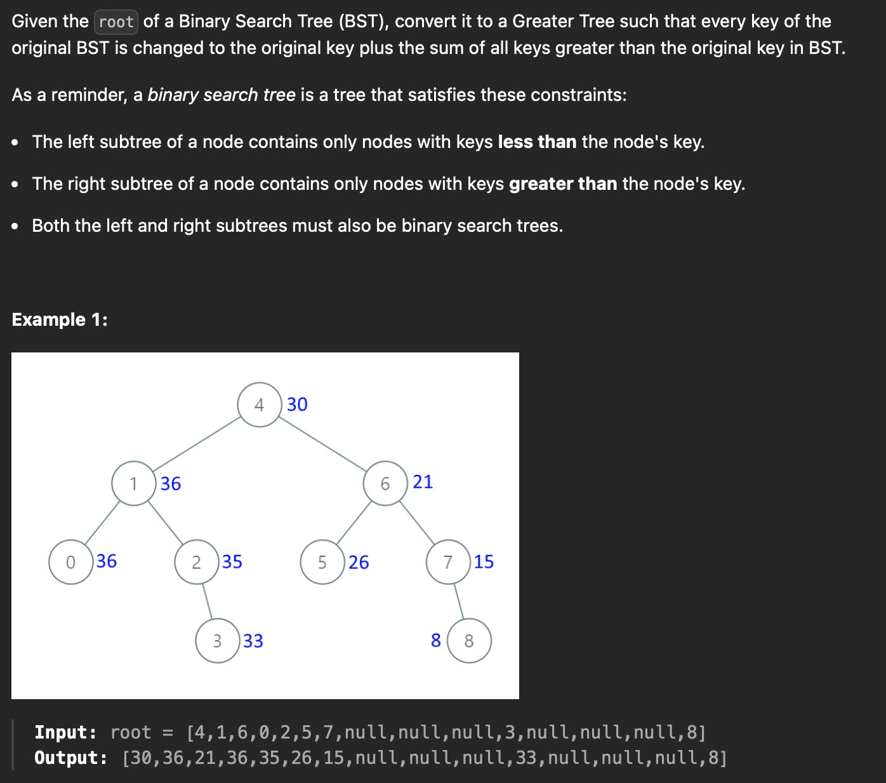
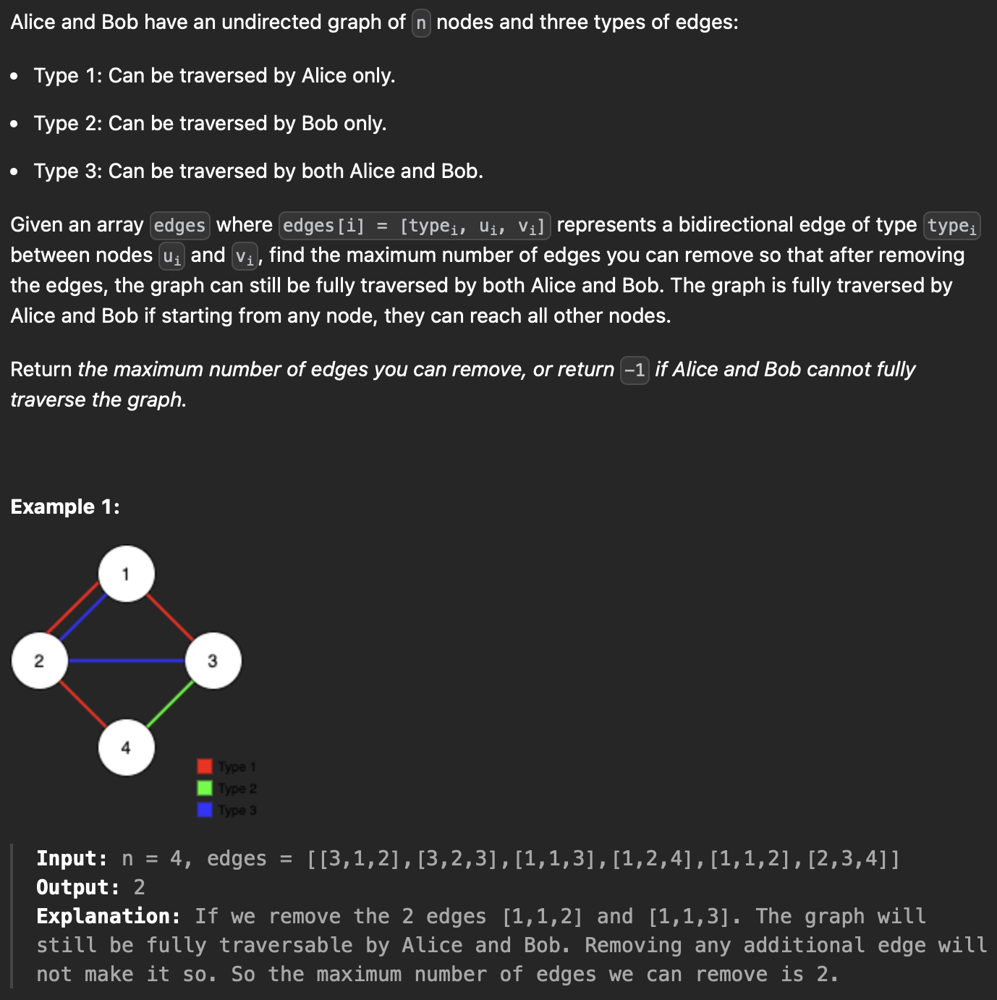
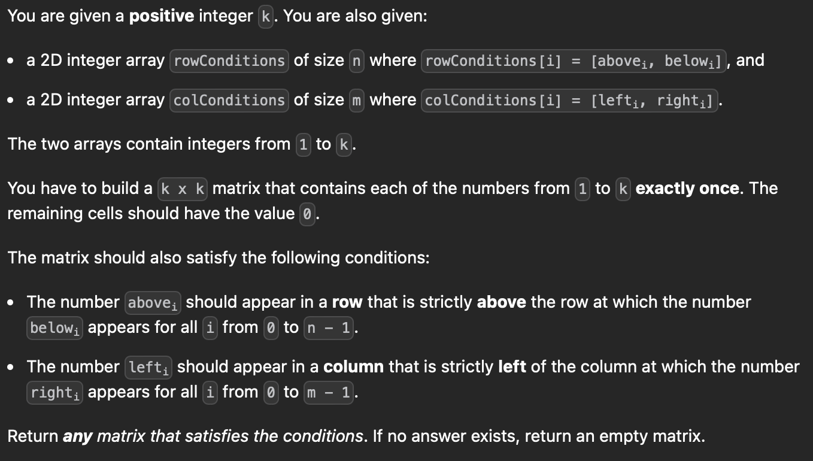
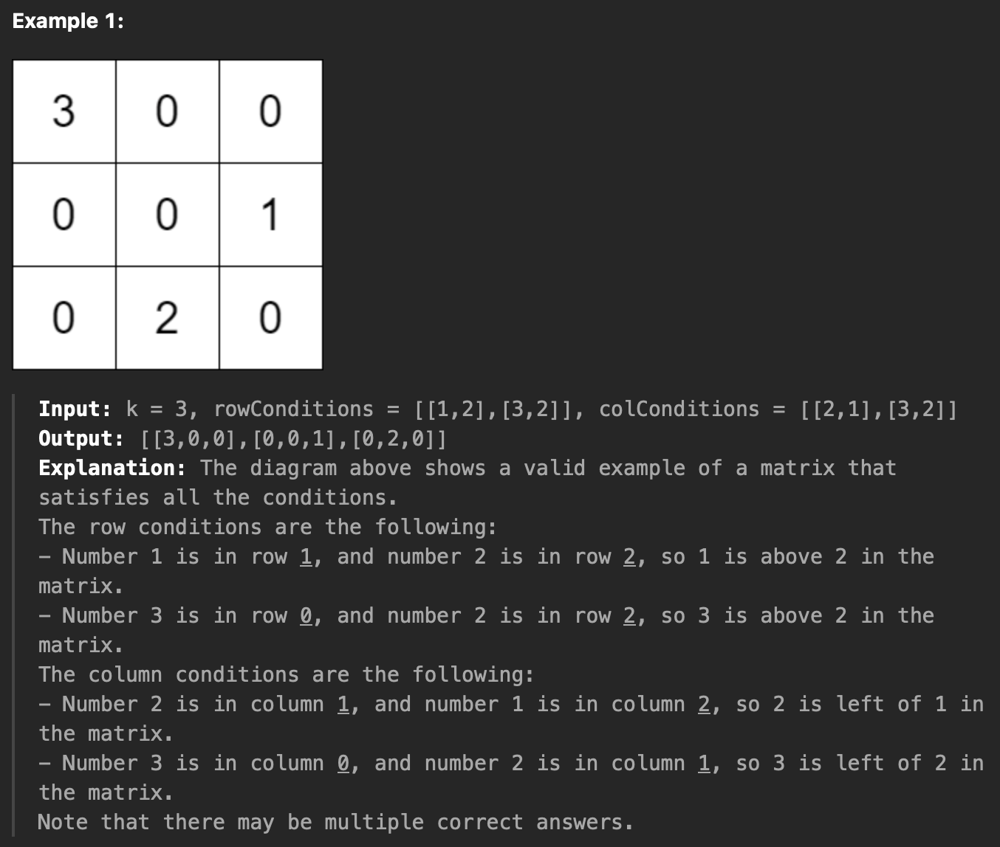
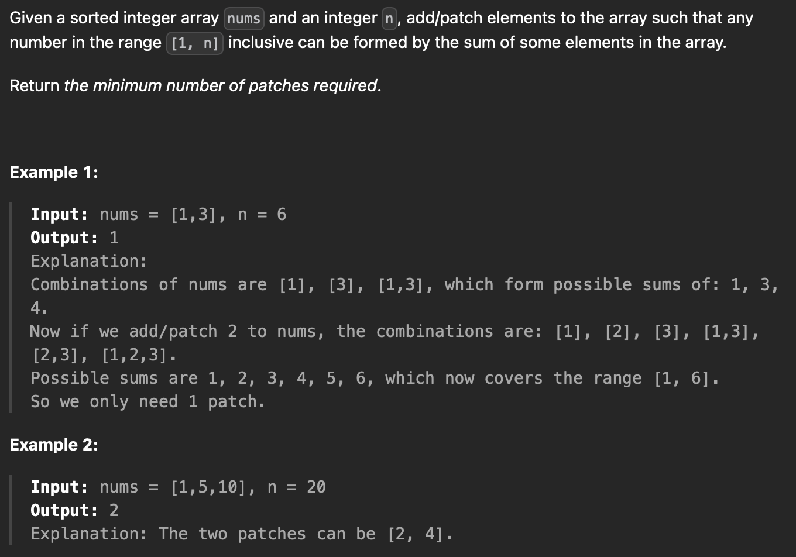

# 1. Binary Search

When facing a problem which need to be solved within ```O(nlog(n))```, or ```O(log(n))``` appears in any forms, try binary search!

In general, binary search is a good try for questions with these characteristics:

1) ***The target value is bounded***

2) ***A direction towards the target value (lower or higher) could be determined given a non-target value***

3) ***It's not very expensive to check whether a value is target or not***

<br/>

## 1552 Magnetic Force b/t Balls

***Difficult: 7/10***

***Interesting: 5/10***

***Educating: 10/10***



<br/>

The reason this question is very educating is that there's only one way to solve it within the required timeframe: binary search.

Its obvious that the result for this question lies within ```[1, position[-1]]```. The observation most people overlooks, however, is that for any "required force" ```x <= result```, ```x``` should also be a valid distance to place ```m``` balls in positions because by definitioin ```result = max(x)``` for all ```x``` that's valid. These characteristics are signs for using binary search.

Now we need to think about the time to verify if a given distance between balls could be accomplished or not.

Given the target absolute distance ```x```, we could start with the first ball at ```position[0]``` and go through the positions until we've reached the first index ```i``` where ```position[i] >= position[0] + x```. We place the second ball at ```position[i]```. Now we start going through positions again begining from index ```i + 1``` until we've reached the first index ```j``` where ```position[j] >= position[i] + x``` and place the third ball there. We continue this process until all ```m``` balls have been place, which means ```x``` as the "required force" could be done, or we run out of positions to place the balls, which means ```x``` as the "required force" could not be done. Either way, it takes ```O(n)``` time to verify whether a given distance is valid.

Therefore performing a binary search on the largest distance bewteen balls would take ```O(n)``` for each verification and ```O(log(n))``` to find the boundary between valid and non-valid "required force", a total of ```O(nlog(n))```.

To reflect the general characteristics of binary search in the case of this question, the target value is the max distance between balls. Observe that

1) The target value is bounded by ```[1, position[-1]]```

2) The target value is the maximum of all valid values. This means if a given value ```x``` is valid, ```target >= x```; if a given value ```y``` is not valid, ```target < y```

3) It only cost one iteration of the entire position array, i.e. ```O(n)```, to check whether a given ```x``` is valid or not

Therefore when facing a question with similar characteristics, always gives binary search a try.

## 1482 Min days to make n bouquets

***Difficult: 6/10***

***Interesting: 6/10***

***Educating: 7/10***



<br/>

The common way to solve this problem is binary search. Think about the runtime to check if a given result would satisfy the criteria. It suppose to be ```O(n)```. Then we can perform a binary search on the result within the max and min of the given days and would produce a result within ```O(nlog(n))```. If the values of the days array is unbounded, we could sort the array first and perform binary search on the indexes of the array instead.

There's another approach to this problem: disjoint set. We could sort the days array and add each day sequentially while maintain a dictionary of the current status, i.e. ranges of blooming flowers. For each newly added position, we try to merge it into adjacent existing ranges, or create a new range itself, as well as maintaining the current max bouquets number, all in constant time. This way there's constant runtime for each position added and every position is added only once therefore the runtime for adding position is ```O(n)```. However, since we sorted the days array in the begining, the overall runtime is also ```O(nlog(n))```.

<br/>

# 2. Dynamic Programming

## 956 Tallest Billboard

***Difficult: 10/10***

***Interesting: /10***

***Educating: /10***



<br/>

TODO

<br/>

# 3. Sliding Window

## 1438 Longest cont subarray w/ abs diff limit

***Difficult: 5/10***

***Interesting: 4/10***

***Educating: 9/10***



<br/>

The original method I used and the sliding window method is quite similar in terms of the general approach of using two pointers representing a subarray to traverse the entire array while keeping track of the absolute difference. Both of these methods would increase right pointer incrementally and move the left pointer rightward until the max absolute difference of the subarray is within the boundary.

However, the later method uses a better storage system that reduces the runtime to ```O(n)``` instead of ```O(nlog(n))```. My initial method uses two heaps, one max heap and one min heap, and a counter dictionary to keep track of the count of values as well as the max absolute difference within the subarray. This requires maintaining heaps which cost ```O(log(n))``` for each operation. Instead, we could accomplish the same goal using two deques, a max deque and a min deque.

Whenever we move the right pointer to the right, we want to insert the new value ```x``` into the two deques so that ```x``` is at the top of the deques and all other values are larger/smaller than ```x``` in maxstack/minstack. Notice that by doing so, the deques would actually be ordered.

***This is a common practice to keep track of the largest/smallest value for a changing array.***

Once the deques are updated, we keep moving the left pointer to the right, remove any bottom values of the deques, namely the largest and smallest value within the subarray, that is equal to the discarded value, until the bottom of the two deques have a absolute difference smaller or equal to the limit.

This method is valid because the deque, take the max deque as an example, is maintained in a way where its sorted in descending order from bottom to top, and each value, if in the deque, is the largest value from the previous max/min (the value one place lower than it in the deque) to the current right end of the array. Therefore when we pop the bottom of the maxdeque/mindeque, the new bottom value is the new max/min of the subarray. A tricky edge case would be duplicate values in the subarray, in which case we keep all the duplicates in the deque.

## 2009 Min number of operation to make array continuous

***Difficult: /10***

***Interesting: /10***

***Educating: /10***



<br/>

There's two different way to solve this question: sliding window, and perhaps surprisingly, binary search.

TODO

<br/>

# 4. Tree

## 1038 BST to Greater Sum Tree

***Difficult: 3/10***

***Interesting: 1/10***

***Educating: 7/10***



<br/>

How to solve this problem using postorder by recursion is relatively easy. A good followup question would be how to solve it using simple stacks (or how to solve inorder/postorder using stacks in general).

(the algorithm below could be optimized using a stack of tuple, but here we assume only simple stacks, i.e. stacks of uniterable types, could be used)

We can start with two stacks, one have ```root``` in it, ```s1```, and another empty, ```s2```, and a sum calculator ```x = 0```. While ```s1``` is not empty, pop the top item in ```s1``` as ```curr```. If ```curr``` is a leaf node, update ```curr.val``` and ```x``` accordingly. If ```curr``` is equal to the top item in ```s2```, update ```curr.val``` and ```x``` accordingly and pop the top itme in ```s2```. In all other cases, push ```curr.left``` to ```s1``` if its not none, push ```curr``` to ```s1``` again, push ```curr``` to ```s2```, and push ```curr.right``` to ```s1``` if its not none. Return ```root``` at the end.

Here ```s2``` serve as a path tracker or visited map. If a parent node is visited for the first time, we add its children to the stack as well as itself, without processing it. The next time this node appears, we process it and does not add anything to the stack to prevent infinite loop.

<br/>

# 5. Graph

## 1579 Remove max # of edges to keep graph fully traversable

***Difficult: 8/10***

***Interesting: 7/10***

***Educating: TODO/10***



<br/>

TODO

<br/>

## 2392 Build a Matrix with Condition

***Difficult: TODO/10***

***Interesting: TODO/10***

***Educating: TODO/10***





<br/>

Kahn's Algorithm

TODO

<br/>

# 6. Math

## 330 Patching array

***Difficult: 9/10***

***Interesting: 10/10***

***Educating: 1/10***



<br/>

Lets first define a simple case where the array is "non-sparse", meaning all numbers within the range of the values, min to max, could be written into a sum. For example, [1, 2, 3, 5, 9] would be a "non-sparse" array where [1, 2, 4, 9, 15] is not because 8 cannot be written into a sum.

From here, It's reasonable to guess that:

1) For a given "non-sparse" array, the next value to be patched/added (if needed) is the sum of the array plus 1. In other words, given a "non-sparse" array ```arr```, the smallest number that cannot be written as the sum of current arr values is the ```sum(arr) + 1```

2) Adding the smallest missing/unreachable/unsumable number is better than adding any number that is smaller than it.

Given these guesses, it's easy to derive the final solution. The hard part, however, lies within the proof of these assumptions.

For guess #1, we can prove it by induction:

Consider the smallest number that cannot be written as a sum of current values, which lets call ```s```.

First we want to argue that ```s``` should be larger than the largest value inside ```arr```, which lets call ```x1```. This is because by definition of "non-sparse" all number smaller or equal to ```x1``` is sumable, i.e. written as a sum of values in ```arr```.

Next we want to argue that ```s``` should be larger than the sum of ```x1``` and ```x2```, which is the second largest value inside ```arr```. This is because if ```s``` is smaller or equal to ```x1 + x2```, we can find a set of values from ```arr```, lets say ```set2```, that sums to ```s - x1``` since ```s - x1 < x1```. We can observe that ```x1``` is not in ```set2``` because the sum of ```set2```, ```s - x1```, is smaller than ```x1```, and a new ```set = set2 + {x1}``` sums to ```s```. Therefore it contradicts the definition that ```s``` is not sumable.

We can further show that ```s``` should be larger than the sum of ```x1```, ```x2```, and ```x3```, which is the third largest value inside ```arr```. This is because if ```s``` is smaller or equal to ```x1 + x2 + x3```, but larger than ```x1 + x2```, we can find a set of values from ```arr```, ```set3```, that sums to ```s - x1 - x2``` since ```s - x1 - x2 < x2```. We can observe that ```x1``` and ```x2``` is not in ```set3``` because the sum of ```set3```, ```s - x1 - x2```, is smaller than ```x1``` or ```x2```, and a new ```set = set3 + {x1, x2}``` sums to ```s```. Therefore it contradicts the definition that ```s``` is not sumable.

Now by induction we could show that ```s``` is greater than the sum of ```x1```, ```x2```, ..., ```xn```, which means that ```s``` is greater than the sum of ```arr```. Therefore the smallest ```s``` possible is ```sum(arr) + 1```.

For guess #2, we can prove it using the result from guess #1.

First, we rewrite guess #2 into a more mathematical term: Given the current array is "non-sparse" and the choice to add ```s = sum(arr) + 1``` or an arbitrary ```p < s``` to the array, adding ```s``` is always the better choice, i.e. create an array that could "sum" more numbers.

By the result from guess #1, we know that for all ```x < s```, ```x``` is sumable without adding any additional value. From there we could argue that by adding either ```s``` or ```p``` to ```arr```, the new array, ```arr_new```, is also "non-sparse". This is because either ```s``` is added, ```max(arr_new) = s``` which is sumable, and therefore all numbers smaller or equal to ```max(arr_new)``` is sumable, or ```p``` is added, ```max(arr_new) = max(p, max(arr)) < s```, and by definition all numbers smaller or equal to ```max(arr_new)``` is sumable.

Now we use the result from guess #1 again which gives us the total sumable numbers of ```arr_new``` for adding ```p``` is ```sum(arr) + p < sum(arr) + s```, the total sumable numbers for adding ```s```. This means adding any ```p < s``` to ```arr``` would lead to less number being able to be sumed from ```arr_new```, compared to adding ```s``` to ```arr```. Therefore adding ```s``` to ```arr``` is always the better choice.

Now that we've proved these assumptions, its easy to write a code to solve this problem in ```O(log(n))```: Start with an empty list, ```arr```, and a counter, ```result```, calculate the current ```s = sum(arr) + 1```. If the first value in ```arr``` smaller or equal to ```s```, remove it from ```nums``` and add it to ```arr```. If the first value is larger than ```s```, add ```s``` to ```arr``` and add 1 to ```result```. Now recalculate ```s``` and repeat this process again until ```s``` > ```n```. Return the counter, ```result```.
